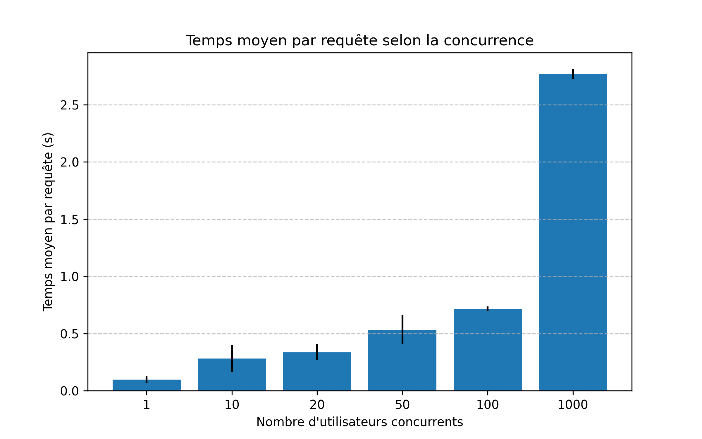
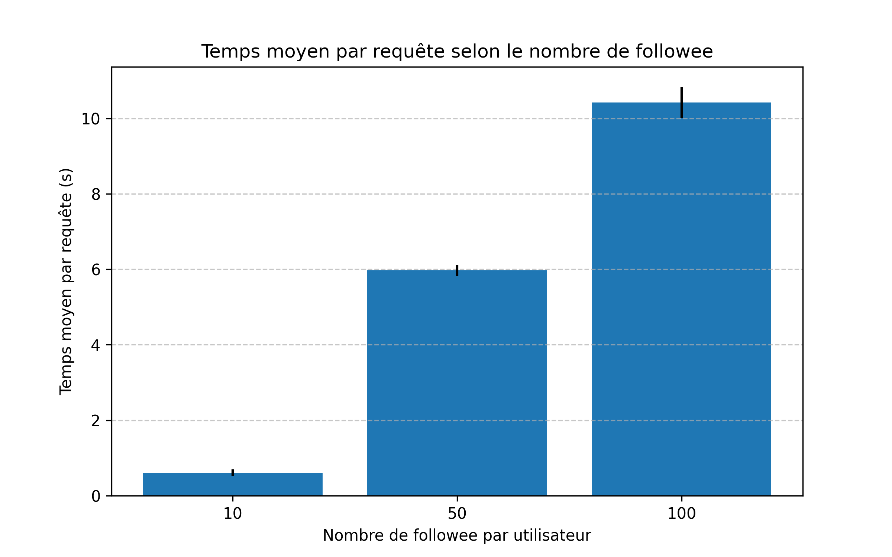

# Projet Données Massives et Cloud

Ce projet a été réalisé dans le cadre du cours **Données Massives et Cloud**.  
Il inclut un système de benchmark permettant d’évaluer la performance de l'application [TinyInstagram](https://github.com/momo54/massive-gcp) selon plusieurs paramètres (nombres d'utilisateurs simultané, nombre de posts par utilisateur, nombre de followee par utilisateur).

---

##  Installation

Avant de lancer le benchmark, il est nécessaire d'installer les dépendances Python python suivantes :
  -  asyncio : https://docs.python.org/3/library/asyncio-task.html
  -  aiohttp : https://pypi.org/project/aiohttp/

```bash
pip install aiohttp asyncio
```

## Lancement
Il est possible de lancer le benchmark complet à l'aide de la commande depuis le cloud shell du compte sur lequelle votre application est lancée: 

```bash
python banchmark.py
```

Il est aussi possible de vider la base de données au besoin avec la commande : 

```bash
python reset_db.py
```

## Résultats




